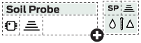
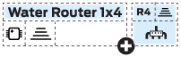
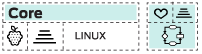
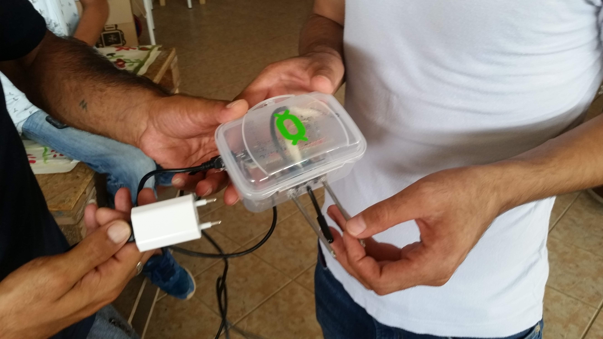
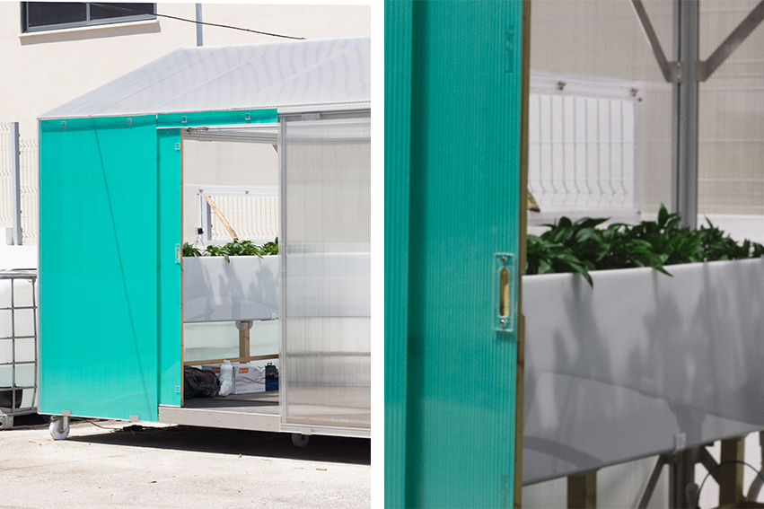

# GROUU - Modular Open Agriculture


## Overview
GROUU enables the implementation of Precision Agriculture / Automation in the context of personal or small scale agricultures.
At the moment, the development goals for GROUU V2 is to implement a local/edge server based on a raspberry pi or other linux mini computer, a sensor node template with wifi communication and other with LoraWAN communication. The same for two actuator templates.
when this basic infrastructure is designed we will apply it to personal contexts in order to test it.
This process will generate new repositores.
This Git repository also archives the personal development and learning process behind the project and research done throught it.

**Let us know if you want to collaborate**

## Table of Contents
1. [GROUU V2](#grouu-v2)
   - [Server Documentation - GROUU Server V2 Configuration](#server-documentation)
   - [Sensor Modules Documentation - GROUU V2 Sensor Modules Configuration](#sensor-modules-documentation)
   - [Actuator Modules Documentation - GROUU V2 Sensor Actuator Configuration](#actuator-modules-documentation)
2. [GROUU V1](#grouu-v1)
   - [Modules V1 - ESP12 Based Version](#modules-v1---esp12-based-version)
   - [Server Configuration - Raspberry Pi Zero W](#server-configuration---raspberry-pi-zero-w)
3. [Archived Projects](#archived-projects)
4. [References](#references)


## GROUU V2

### Sensor Modules Documentation
GROUU V2 Sensor Modules Configuration

[/ARDUINO/GROUU_V2/](/ARDUINO/GROUU_V2/)

#### GROUU V2 WiFi Sensor Node Template


#### GROUU V2 LoRA Sensor Node Template


### Actuator Modules Documentation
GROUU V2 Sensor Actuator Configuration

### Server Documentation
GROUU Server V2 Configuration(GROUU Stack V1)


The GROUU Stack V1 (part of GROUU V2) provides an advanced foundation for your open-source IoT farming project:

1. Mosquitto for MQTT messaging between your farming sensors and the system
2. Node-RED for creating workflows and processing data from your farm
3. InfluxDB for storing time-series data from your agricultural sensors
4. Grafana for creating dashboards to visualize your farming data

#### GROUU Stack V1 Installation and Deployment Tutorial

This guide will help you set up the GROUU Stack V1, an open-source IoT solution for personal and small-scale farming.

##### 1. Install Docker

First, we need to install Docker on your Linux system:

```bash
# Update and upgrade the system
sudo apt update && sudo apt upgrade -y

# Install required packages
sudo apt install -y apt-transport-https ca-certificates curl gnupg lsb-release

# Add Docker's official GPG key and set up the repository
curl -fsSL https://get.docker.com -o get-docker.sh
sudo sh get-docker.sh

# Add your user to the docker group
sudo usermod -aG docker $USER

# Enable Docker to start on boot
sudo systemctl enable docker
```

Log out and log back in for the group changes to take effect.

##### 2. Install Portainer

Now, let's install Portainer:

```bash
# Create volume for Portainer
docker volume create portainer_data

# Install Portainer CE
docker run -d -p 8000:8000 -p 9000:9000 --name=portainer --restart=always \
  -v /var/run/docker.sock:/var/run/docker.sock \
  -v portainer_data:/data \
  portainer/portainer-ce
```

##### 3. Access Portainer

Open a web browser and navigate to `http://your-server-ip:9000`. You'll be prompted to create an admin user.

##### 4. Deploy the GROUU Stack V1

1. In Portainer, go to "Stacks" and click "Add stack".
2. Name your stack "GROUU-Stack-V1".
3. In the "Web editor" tab, paste the GROUU Stack V1 configuration:

```yaml
version: '3'

services:
  mosquitto:
    image: eclipse-mosquitto:latest
    ports:
      - "1883:1883"
    volumes:
      - mosquitto-config:/mosquitto/config
      - mosquitto-data:/mosquitto/data
      - mosquitto-log:/mosquitto/log
    restart: always

  nodered:
    image: nodered/node-red:latest
    ports:
      - "1880:1880"
    volumes:
      - nodered-data:/data
    restart: always

  influxdb:
    image: influxdb:latest
    ports:
      - "8086:8086"
    volumes:
      - influxdb-data:/var/lib/influxdb
    environment:
      - INFLUXDB_DB=grouudb
      - INFLUXDB_ADMIN_USER=admin
      - INFLUXDB_ADMIN_PASSWORD=grouuadmin  # Remember to change this password
    restart: always

  grafana:
    image: grafana/grafana:latest
    ports:
      - "3000:3000"
    volumes:
      - grafana-data:/var/lib/grafana
    restart: always

volumes:
  mosquitto-config:
  mosquitto-data:
  mosquitto-log:
  nodered-data:
  influxdb-data:
  grafana-data:
```

4. Click "Deploy the stack".

##### 5. Post-Deployment Steps

After deploying the GROUU Stack V1, you can access its components:

1. Node-RED (for flow-based programming): `http://your-server-ip:1880`
2. InfluxDB (time-series database): Use the InfluxDB CLI or API at `http://your-server-ip:8086`
3. Grafana (for visualization): `http://your-server-ip:3000`
4. Mosquitto (MQTT broker): Use an MQTT client to connect to `your-server-ip:1883`

Remember to replace `your-server-ip` with your actual server IP address.

##### 6. Security Considerations

- Change default passwords for all services in the GROUU Stack V1
- Use SSL/TLS for MQTT if exposing your farming data to the internet
- Set up proper firewalls and access controls
- Regularly update all containers and the host system to ensure your farming data remains secure

Congratulations! You now have the GROUU Stack V1 up and running for your personal or small-scale farming IoT project.

#### Manual Installation Guide

If you prefer not to use the stack configuration, you can follow these steps for manual installation:

#### 1. Install Docker

Follow the Docker installation steps from the stack installation guide above.

#### 2. Install Portainer CE and Portainer Agent

```bash
# Create volume for Portainer
docker volume create portainer_data

# Install Portainer CE
docker run -d -p 8000:8000 -p 9000:9000 --name=portainer --restart=always -v /var/run/docker.sock:/var/run/docker.sock -v portainer_data:/data portainer/portainer-ce

# Install Portainer Agent
docker run -d -p 9001:9001 --name portainer_agent --restart=always -v /var/run/docker.sock:/var/run/docker.sock -v /var/lib/docker/volumes:/var/lib/docker/volumes portainer/agent
```

#### 3. Install Containers via Portainer

Access Portainer web interface at `http://your-server-ip:9000` and follow these steps for each container:

##### 3.1 Mosquitto (MQTT Broker)

1. Go to "Containers" > "Add container"
2. Name: mosquitto
3. Image: eclipse-mosquitto:latest
4. Port mapping: 1883:1883
5. Volumes:
    - /path/to/mosquitto/config:/mosquitto/config
    - /path/to/mosquitto/data:/mosquitto/data
    - /path/to/mosquitto/log:/mosquitto/log

##### 3.2 Node-RED

1. Go to "Containers" > "Add container"
2. Name: nodered
3. Image: nodered/node-red:latest
4. Port mapping: 1880:1880
5. Volumes:
    - /path/to/nodered/data:/data

##### 3.3 InfluxDB

1. Go to "Containers" > "Add container"
2. Name: influxdb
3. Image: influxdb:latest
4. Port mapping: 8086:8086
5. Volumes:
    - /path/to/influxdb/data:/var/lib/influxdb
6. Environment variables:
    - INFLUXDB_DB=mydb
    - INFLUXDB_ADMIN_USER=admin
    - INFLUXDB_ADMIN_PASSWORD=adminpassword

##### 3.4 Grafana

1. Go to "Containers" > "Add container"
2. Name: grafana
3. Image: grafana/grafana:latest
4. Port mapping: 3000:3000
5. Volumes:
    - /path/to/grafana/data:/var/lib/grafana

#### 4. Post-Installation Steps

Follow the post-deployment steps and security considerations from the stack installation guide above.

## GROUU V1

### Modules V1 - ESP12 Based Version
*Under development - design (boards, enclosures), firmware (Arduino)*

#### Types:
- Core
- S modules (wireless sensors)
- A modules (actuator modules)

#### Development Goals
- The way the module is powered is not yet fully defined: All should have batteries (3.3V _____ Amps), some should have only this as power source and be periodically charged (induction most probably), and others, can be connected to a power source (solar, network, wind...) for constant charging;
- A power source (ex: solar panel) can be a module on its own and an induction charger can be another module (tbd - to be designed);
- The following code:
```cpp
const String Instalation = "myFarm"; //Where is it?
const String IDCODE = "1"; //number your probe
const String TYPE = "SoilProbe"; //choose type
const String Host = "Grouu" + Instalation + TYPE + IDCODE; //just change if it is not grouu and you're adapting the code for something else
const char * OTA_PASSWORD  = "yourpasswordhere";
```
will allow you to set a hostname (Host) - These are the only parameters you should have to change before injecting the firmware on your board (we should work on an even simpler method);

- This hostname (`const String Host`):
  1. will be the name of the network the device generates each time it is not able to connect to any wireless network;
  2. Will identify the MQTT addresses being used by that type of device (expl: `HostName/Sensor/Moist1`);

- There shouldn't be a limit for the amount of modules developed nor used. The scale and context should dictate these options.
- All Explorations, independently from the context or scale should be considered valid data generators;

#### Call for Collaboration

It is permanent, develop whatever you want whenever you want!

#### Current Modules

##### Soil Probe

- The soil probe reads Soil Moisture and Soil Temperature;
- You can add as many as you want in order to measure these in as many points as you wish.

###### Design
- eagleCAD: [Link to eagleCAD files]
- Fusion 3D (plastic 3D print Enclosure): [Link to Fusion 3D files]

###### Code
- Arduino IDE Firmware: [Link to Arduino code]

##### Water Router

- The water router uses a standard 1 in 4 out electrovalves from a washing machine. You should also decrease the water pressure on the outputs for microirrigation.
- You can use this directly to the network or after a motor (be careful with the pressure in compatibility). You can add as many as you want in the system.

###### Design
- eagleCAD: [Link to eagleCAD files]
- Fusion 3D (plastic 3D print Enclosure): [Link to Fusion 3D files]

###### Code
- Arduino IDE Firmware: [Link to Arduino code]

##### Core

- Core is the local server. Right now is mostly a test hub where the data from the networked servers is received and processed.
- We are using Node-Red but all collaboration is welcomed!

###### Design
Right now we are using a standard Raspberry case.

### Server Configuration - Raspberry Pi Zero W

#### Configuring Raspberry Pi Zero W as server

1. Configuring the Pi: [Tutorial Link](https://core-electronics.com.au/tutorials/raspberry-pi-zerow-headless-wifi-setup.html)

2. Accessing through ssh on mac or linux terminal: [Tutorial Link](https://www.raspberrypi.org/documentation/remote-access/ssh/unix.md)

3. Upgrade Node-Red and Node.js
```bash
sudo apt-get update
sudo apt-get upgrade
bash <(curl -sL https://raw.githubusercontent.com/node-red/raspbian-deb-package/master/resources/update-nodejs-and-nodered)
sudo systemctl enable nodered.service
```
- Connect to Raspberry Pi Node-red console through your browser by accessing `http://"raspipaddress":1880`

- Install Mosquitto MQTT broker
```bash
sudo apt-get install mosquitto
```

Some instructions on how to test here: [Instructables Tutorial](https://www.instructables.com/id/Installing-MQTT-BrokerMosquitto-on-Raspberry-Pi/)

4. Other useful links:
   Security: manage permissions on node-red tutorial - [YouTube Tutorial](https://www.youtube.com/watch?v=GeN7g4bdHiM)


## Archived Projects

### Main Soil Probe REV0
Developed at the Habibi Works (Ioannina, Greece) CultiMake Workshop - P2PLab


#### Design
- eagleCAD: A provisional board (not working!!) is on [/BOARDS/soilProbe/Archive](/BOARDS/soilProbe/Archive)
- For this example, a nodeMCU dev board was used and tested at the workshop (see Habibi.Works [Workshop Journal](WORKSHOP/habibiWorksJuly2018/workshopJournal.md))
- Enclosure: A standard plastic box was used for demo purposes.

This board includes:
- 1 x 4 male header for DHT22 Temperature and Humidity Sensor
- 1 x 3 male header for DS18B20 (encapsulated version for Soil Temperature)
- 2 x 2 male header connections for Moisture 10k with Two probes
- 1 led (no usage yet, mostly for debug purposes)
- 1 ftdi set headers
- 1 voltage converter 12V - 3,3V
- 1 x 2 screw headers to add solar panel + battery (maybe connect solar battery pack now)

#### Code
Arduino IDE Firmware: [/ARDUINO/habibiWorksJuly2018-WS/grouu-irr](/ARDUINO/habibiWorksJuly2018-WS/grouu-irr)

### GROUU Greenhouse


#### Design
- SolidWorks files for the complete Structure (to be added) - also check constructive system (levosystems.com)
- Photos (soon)
- Other Diagrams (soon)

#### Code
Arduino Yun code: [/ARCHIVE/arduino/GROUU_GREENHOUSE_0/](/ARCHIVE/arduino/GROUU_GREENHOUSE_0/)

## References

